# 📱 DroidDesk — Local Android Development & APK Analysis Companion

> **DroidDesk** is an all-in-one local desktop companion for Android developers, QA testers, and security researchers. Inspect APKs, audit permissions and signatures, mirror and record device screens, scan for leaked credentials offline, and monitor real-time Logcat streams without cloud dependencies.

---

## 📥 Downloads (Latest Release v1.0.0)

| File | Version | Architecture | Size | Direct Download Link |
| :--- | :---: | :---: | :---: | :--- |
| **DroidDesk-Setup-v1.0.0.exe** | 1.0.0 | Windows x64 | ~217 MB | [⬇️ Download v1.0.0 Setup](installer/DroidDesk-Setup-v1.0.0.exe) |

---

## ⚡ Quick Start: Easy 3-Step Setup

### Step 1: Install DroidDesk
1. Download **[DroidDesk-Setup-v1.0.0.exe](installer/DroidDesk-Setup-v1.0.0.exe)**.
2. Double-click the file to open the setup wizard.
3. Follow the on-screen prompts to complete installation and create a desktop icon.
4. Launch **DroidDesk** from your Desktop or Start Menu.

*(Note: If Windows SmartScreen displays a warning, click ** More info** and then **Run anyway**).*

---

### Step 2: Enable USB Debugging on Your Android Phone
1. On your Android phone, go to **Settings** > **About Phone**.
2. Tap **Build Number** **7 times** until you see *You are now a developer!*.
3. Go back to **Settings** > **Developer Options** (or *System > Developer options*).
4. Turn on **USB Debugging**.
5. Connect your phone to your PC via a USB cable.
6. When prompted on your phone screen with *Allow USB debugging?*, check **Always allow from this computer** and tap **Allow**.

---

### Step 3: Start Analyzing & Testing!
- **Drop an APK**: Drag and drop any .apk file directly into DroidDesk to inspect its package details, activities, permissions, certificates, and secrets.
- **Screen Mirror & Record**: Go to **Device Control** or **Screen Mirror** to interact with your phone in real-time and record test sessions.
- **Logcat**: Monitor live system and app logs with color-coded severity levels and instant regex search.

---

## 📸 Visual Tour & Demo Walkthrough (From Home to Settings)

Explore DroidDesk's complete interface step-by-step. Each page below follows the exact sidebar menu flow from **Home** down to **Settings**, complete with interface breakdowns, live feature tours, and actionable demo instructions.

| # | Page Name | Menu Category | Key Highlights Visible in Screenshot |
| :-: | :--- | :--- | :--- |
| **01** | [🏠 Home Dashboard](#1--home-overview--quick-launcher) | `OVERVIEW` | Active project summary, quick-launch actions, 1-click APK installer, device history |
| **02** | [📱 Device Manager](#2--device-manager--wireless-adb-pairing) | `CONNECT` | Real-time device polling, Wi-Fi ADB pairing, hardware specs, density & ABI inspector |
| **03** | [🖥️ Screen Mirror](#3-️-live-screen-mirroring--remote-control) | `CONNECT` | 60 FPS low-latency scrcpy mirror, touch gestures, keyboard forwarding, stream presets |
| **04** | [⚡ Logcat Viewer](#4--real-time-logcat-stream--query-engine) | `CONNECT` | Columnar log parser, multi-level severity filters (V/D/I/W/E/F), regex search, export |
| **05** | [📸 Screenshots Gallery](#5--screenshot-gallery--inspector) | `CONNECT` | On-demand screen capture, resolution metadata, one-click copy to clipboard, explorer sync |
| **06** | [🎥 Screen Recordings](#6--video-recordings-manager--player) | `CONNECT` | Video capture archive, integrated MP4 player, metadata inspector, folder launcher |
| **07** | [🔍 APK Analyzer](#7--deep-apk-analyzer--permissions-audit) | `INSPECT` | SDK targets, component counts, high-risk permission breakdown, signature verification |
| **08** | [🧪 Test Runner](#8--automated-smoke-testing-pipeline) | `INSPECT` | Millisecond-timed automated install-launch-observe-capture-clean cycle, pass verdict |
| **09** | [🛡️ Secret Scanner](#9-️-offline-secret--credential-leak-scanner) | `PROTECT` | Built-in Gitleaks engine, leaked token detection, syntax-highlighted code context, remediation |
| **10** | [🗂️ File Organizer](#10-️-smart-file-organizer--batch-renamer) | `PROTECT` | Suggested standardized names, 3-tier xxhash64 deduplication, transactional undo journal |
| **11** | [🚀 Build Commands](#11--commands-selection--security-audit-hub) | `SHIP` | 50 built-in commands, simulated APK string extraction & hot data leak test, live console |
| **12** | [⚙️ Settings & About](#12-️-settings-inspection-history--credits) | `SETTINGS` | APK inspection history, developer attribution, team recognition, native tool locator |

---

### 1. 🏠 Home Overview & Quick Launcher
> **Sidebar Route:** `OVERVIEW > Home`

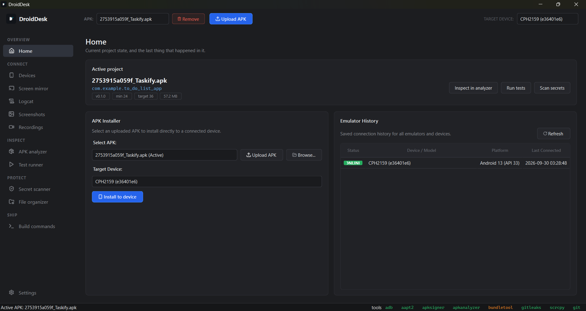

#### 🔍 What You See on Screen
- **Active Project Banner:** Highlights the active APK (`2753915a059f_Taskify.apk`) and package name (`com.example.to_do_list_app`) along with quick metadata tags: `v0.1.0 (1)`, `min 24 (Android 7.0)`, `target 36 (Android 16)`, and file size (`57.2 MB`).
- **Quick-Action Shortcuts:** One-click shortcuts to jump directly to **Inspect in analyzer**, **Run tests**, or **Scan secrets**.
- **1-Click APK Installer:** Choose the active APK or browse external files, select your connected hardware (`CPH2159`), and click **Install to device** without touching the command line.
- **Emulator & Device History Table:** Displays live connection status (green `ONLINE`), device model, Android platform (`Android 13 / API 33`), and timestamp of last connection.
- **Native Tool Status Strip (Bottom Bar):** Real-time health indicators verifying that `adb`, `aapt2`, `apksigner`, `apkanalyzer`, `bundletool`, `gitleaks`, `scrcpy`, and `git` are ready.

#### Demo User Instructions
1. Drag and drop any `.apk` file anywhere into DroidDesk or click **Upload APK** in the top bar.
2. Verify that the project card updates with package identifier, SDK levels, and file size.
3. Select your target device from the dropdown and click **Install to device**.
4. Use the quick action buttons to instantly transition into static analysis, testing, or credential audits.

---

### 2. 📱 Device Manager & Wireless ADB Pairing
> **Sidebar Route:** `CONNECT > Devices`

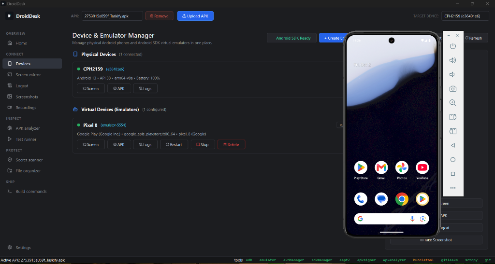

#### 🔍 What You See on Screen
- **Connected Devices Roster:** Polled every 2 seconds when focused (5 seconds in background). Shows status (`READY`), Model (`CPH2159`), Serial number (`e36401e6`), Android version (`13`), API level (`33`), Architecture ABI (`arm64-v8a`), and Connection link (`USB`).
- **Wireless Wi-Fi Pairing:** Input field pre-configured for IP & port (e.g., `192.168.1.24:5555`) with instant **Connect over Wi-Fi** and **Refresh** buttons.
- **Device Hardware Inspector (Right Panel):** Detailed hardware metrics including screen pixel density (`480dpi`), ABI, and assigned test profile.
- **Action Launchpad:** Instant shortcuts to **Share screen**, **Open logcat**, or **Take screenshot** for the highlighted device.

#### Demo User Instructions
1. Connect your Android phone via USB cable and confirm the *Allow USB debugging* prompt on the phone screen.
2. Look for the green `READY` status dot in the Devices table.
3. To switch to wireless mode: enter your phone's Wi-Fi IP address and port, then click **Connect over Wi-Fi**. You can now disconnect the physical USB cable!
4. Click **Share screen** to launch the low-latency mirroring window immediately.

---

### 3. 🖥️ Live Screen Mirroring & Remote Control
> **Sidebar Route:** `CONNECT > Screen mirror`

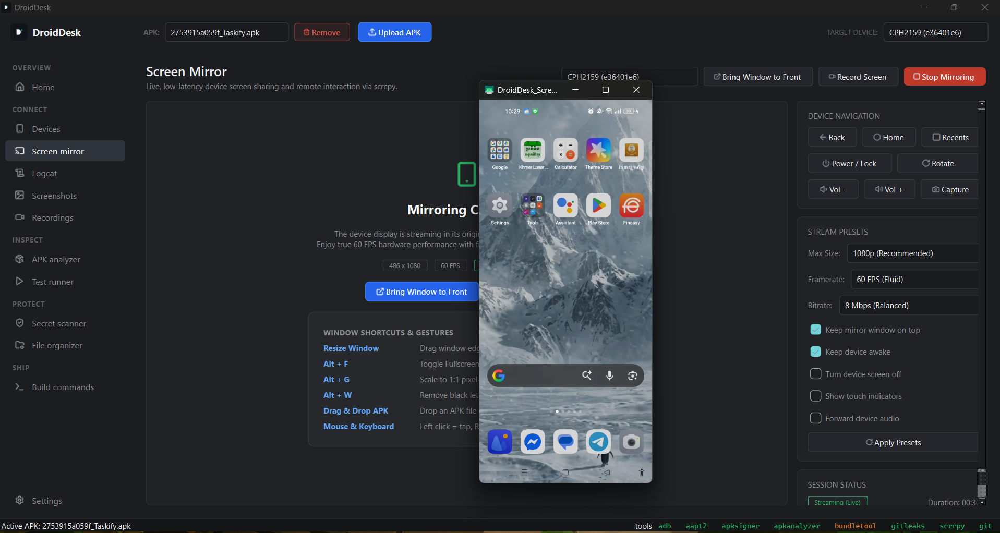

#### 🔍 What You See on Screen
- **Embedded Scrcpy Mirror:** 60 FPS hardware-accelerated interactive view of your Android phone screen. Full support for mouse clicks, swipes, taps, and keyboard text entry.
- **Device Navigation Virtual Toolbar:** Dedicated hardware buttons on the right: `Back`, `Home`, `Recents`, `Power / Lock`, `Rotate`, `Vol -`, `Vol +`, and `Capture`.
- **Window Shortcuts & Gestures Guide:** Handy reference for desktop productivity:
  - `Resize Window`: Freely drag window borders.
  - `Alt + F`: Toggle true Fullscreen mode.
  - `Alt + G`: Scale view to 1:1 pixel-accurate ratio.
  - `Alt + W`: Eliminate black letterboxing bars.
  - `Drag & Drop APK`: Drag any APK directly onto the mirrored screen to trigger an immediate install.
- **Stream Presets & Display Tuning:**
  - Max Size: `1080p (Recommended)`
  - Framerate: `60 FPS (Fluid)`
  - Bitrate: `8 Mbps (Balanced)`
  - Convenience toggles: `Keep mirror window on top`, `Keep device awake`, `Turn device screen off` (saves phone battery while testing), `Show touch indicators`, and `Forward device audio`.
- **Live Session Status:** Real-time stream indicator and duration counter (`Streaming (Live) · 00:31`).

#### Demo User Instructions
1. Navigate to **Screen mirror** and click **Bring Window to Front** if minimized.
2. Click and swipe across the mirrored phone display using your mouse just like physical touchscreen gestures.
3. Type using your physical PC keyboard into text fields on your phone.
4. Try dragging an APK file from Windows Explorer directly onto the phone screen to test instant drag-and-drop installation.

---

### 4. ⚡ Real-Time Logcat Stream & Query Engine
> **Sidebar Route:** `CONNECT > Logcat`

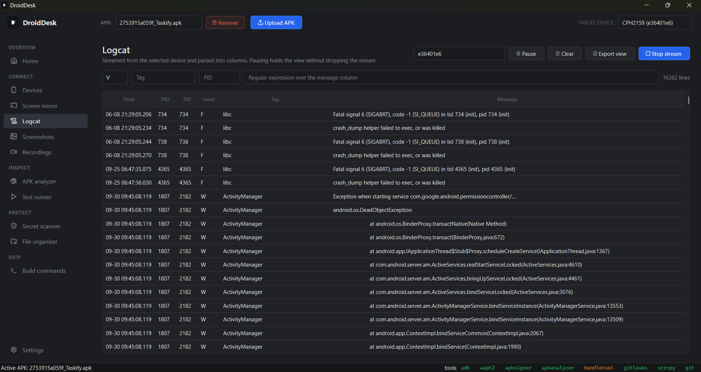

#### 🔍 What You See on Screen
- **Parsed Log Columns:** High-throughput streaming table with clean columns: `Time`, `PID` (Process ID), `TID` (Thread ID), `Level`, `Tag`, and `Message`.
- **Severity Level Filter:** Instant filter buttons for log severities: `V` (Verbose), `D` (Debug), `I` (Info), `W` (Warning), `E` (Error), and `F` (Fatal).
- **Multi-Field Search Bar:** Targeted query boxes for filtering by specific **Tag**, **PID**, and real-time **Regular Expression (Regex)** over the message body.
- **Stream Buffer Controls:**
  - `Pause`: Freezes screen inspection without dropping incoming log events in the background.
  - `Clear`: Flushes current table display.
  - `Export view`: Exports current filtered log records to file for bug attachments.
  - `Stop stream` / `Start stream`: Halts or resumes logcat listener.
- **Buffer Counter:** Tracks total parsed records (e.g., `16,262 lines`).

#### Demo User Instructions
1. Click **Logcat** in the sidebar. Streaming begins automatically for the connected device.
2. In the **Tag** box, enter `ActivityManager` or your application's tag to isolate relevant entries.
3. Switch severity level to `W` (Warn) or `E` (Error) to immediately spot exceptions, crashes, or deadlocks.
4. Click **Pause** to inspect a stack trace in peace, then click **Export view** to save the log excerpt.

---

### 5. 📸 Screenshot Gallery & Inspector
> **Sidebar Route:** `CONNECT > Screenshots`

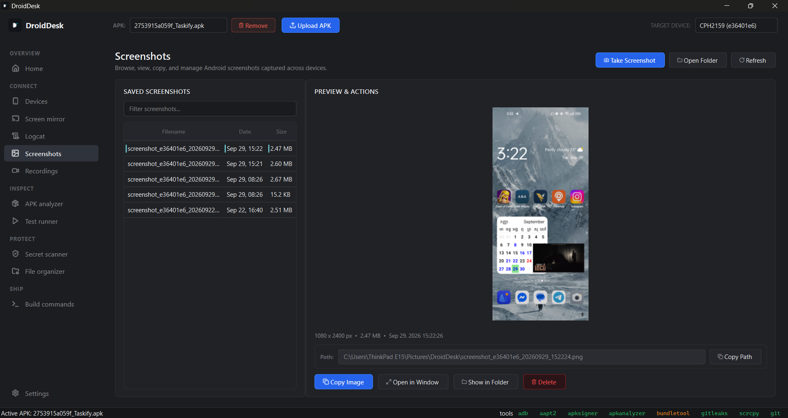

#### 🔍 What You See on Screen
- **Saved Screenshots Archive:** Chronological list of captures with timestamp, file name, and file size metadata (e.g., `Sep 29, 15:22 · 2.47 MB`) with dynamic search filter.
- **High-Definition Preview Pane:** High-res preview showing exact image pixel dimensions (`1080 x 2400 px`), file size, and creation date.
- **Export & Clipboard Actions:**
  - `Copy Image`: Instantly copies the full image bitmap to your Windows clipboard — ready to paste (`Ctrl + V`) into Slack, Figma, GitHub, or Jira.
  - `Copy Path`: Copies the exact absolute file path (`C:\Users\...\Pictures\DroidDesk\...`).
  - `Open in Window`: Launches in default desktop photo viewer.
  - `Show in Folder`: Opens the destination folder in Windows File Explorer.
  - `Delete`: Removes unwanted test captures.
- **Header Actions:** One-click `Take Screenshot` button, `Open Folder`, and `Refresh`.

#### Demo User Instructions
1. Click the blue **Take Screenshot** button in the top right.
2. Notice the new capture appears immediately in the list with a crisp thumbnail preview.
3. Click **Copy Image** and press `Ctrl + V` into your chat or documentation to share proof of test results instantly.

---

### 6. 🎥 Video Recordings Manager & Player
> **Sidebar Route:** `CONNECT > Recordings`

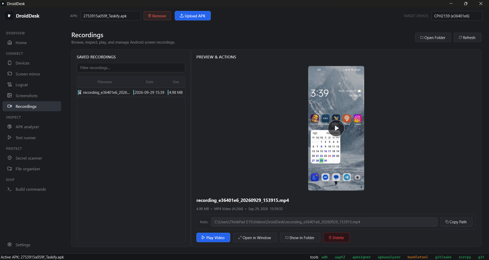

#### 🔍 What You See on Screen
- **Saved Recordings Library:** List of `.mp4` video recordings captured during device test runs (`recording_e36401e6_*.mp4`), complete with date and size (`4.98 MB`).
- **Integrated Video Player Preview:** Video thumbnail with playback overlay, encoding format (`MP4 Video (H.264)`), and recording timestamp.
- **Playback & Management Controls:**
  - `Play Video`: Opens the video in DroidDesk's media player.
  - `Open in Window`: Launches playback in your system media player (e.g. VLC or Windows Media Player).
  - `Show in Folder`: Reveals the `.mp4` file in File Explorer.
  - `Copy Path`: Copies the video path to clipboard.
  - `Delete`: Deletes the file from disk.
- **Header Tools:** `Open Folder` button to browse all captured video files directly on disk.

#### Demo User Instructions
1. Start a recording session anytime from the **Screen Mirror** page using the **Record Screen** button.
2. Perform your app test flow, then stop recording.
3. Head over to **Recordings** in the sidebar.
4. Click the recording from the list and hit **Play Video** to review the captured QA test run.

---

### 7. 🔍 Deep APK Analyzer & Permissions Audit
> **Sidebar Route:** `INSPECT > APK analyzer`

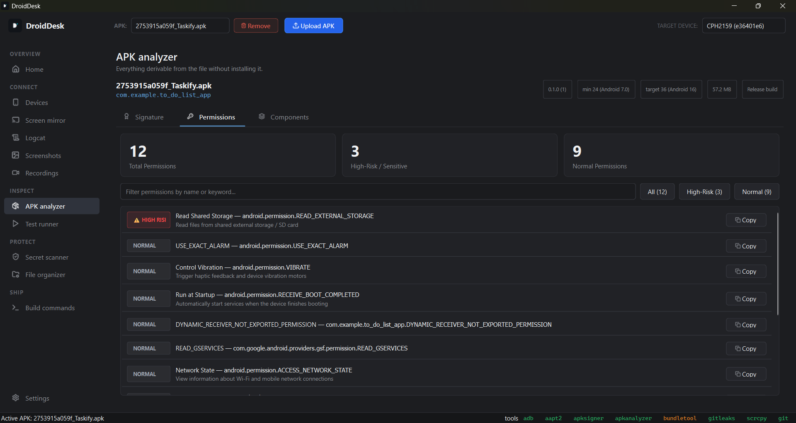

#### 🔍 What You See on Screen
- **Comprehensive APK Metadata:** Displays filename (`2753915a059f_Taskify.apk`), Package (`com.example.to_do_list_app`), Version Code & Name (`0.1.0 (1)`), `min 24 (Android 7.0)`, `target 36 (Android 16)`, file size (`57.2 MB`), and build flavor (`Release build`).
- **Audit Tabs:**
  - `Signature`: Audit APK Signature Scheme (v1, v2, v3, v4) and cryptographic hashes (MD5, SHA-1, SHA-256).
  - `Permissions`: Inspect all declared manifest permissions with risk-level categorization.
  - `Components`: Audit declared Activities, Services, Broadcast Receivers, and Content Providers.
- **Permission Risk Metric Cards:**
  - Total Permissions: `12`
  - High-Risk / Sensitive: `3` (Flagged in red alerts)
  - Normal Permissions: `9`
- **Security Assessment Flags:** Highlights sensitive permissions (e.g. `HIGH RISK: Read Shared Storage — android.permission.READ_EXTERNAL_STORAGE`) with human-readable explanations of privacy and security risks.
- **Filters & One-Click Copy:** Fast filtering by risk group (`All (12)`, `High-Risk (3)`, `Normal (9)`) with dedicated `Copy` buttons for each permission string.

#### Demo User Instructions
1. Load any target `.apk` file into DroidDesk.
2. Click **APK analyzer** and select the **Permissions** tab.
3. Click the **High-Risk (3)** filter button to immediately review potentially dangerous permissions (e.g. storage access, exact alarms, boot startup).
4. Switch to the **Signature** tab to verify that the APK is properly signed with modern v2/v3 signing schemes before release.

---

### 8. 🧪 Automated Smoke Testing Pipeline
> **Sidebar Route:** `INSPECT > Test runner`

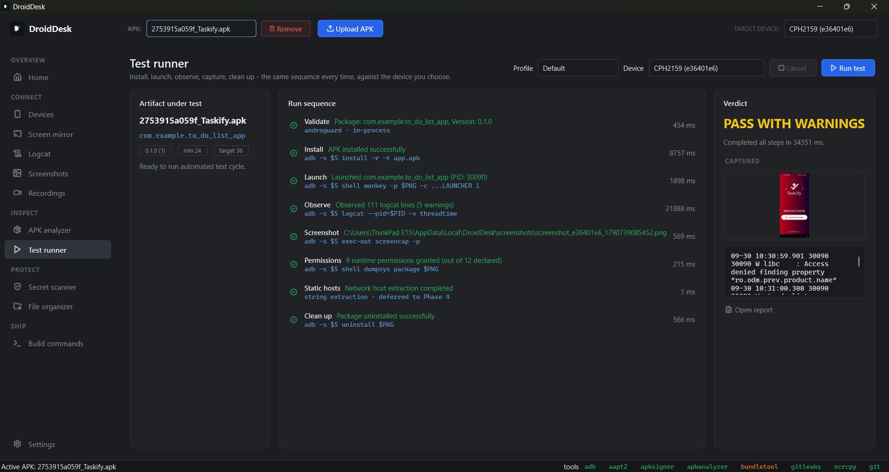

#### 🔍 What You See on Screen
- **Artifact Under Test:** Target APK, package name, version, and target SDK ready for validation.
- **Granular Millisecond-Accurate Execution Sequence:** Complete automated smoke test pipeline:
  - ⏱️ **Validate** (`454 ms`): In-process manifest and integrity verification using androguard.
  - ⏱️ **Install** (`8,757 ms`): Pushes APK to target phone (`adb -s $S install -r -t app.apk`).
  - ⏱️ **Launch** (`1,898 ms`): Spawns main launcher activity via monkey runner (`PID: 30090`).
  - ⏱️ **Observe** (`21,888 ms`): Monitors live logcat for crashes, fatal signals, and warnings (111 lines analyzed, 5 warnings tracked).
  - ⏱️ **Screenshot** (`569 ms`): Takes automatic post-launch screencap to confirm UI rendered properly.
  - ⏱️ **Permissions** (`215 ms`): Verifies runtime permissions granted (9 of 12 granted).
  - ⏱️ **Static hosts** (`1 ms`): Extracts declared network endpoints and hostnames.
  - ⏱️ **Clean up** (`566 ms`): Silently uninstalls test package from phone (`adb -s $S uninstall $PKG`).
- **Test Verdict & Summary Panel:**
  - High-visibility verdict banner: `PASS WITH WARNINGS` (Completed all steps in `34,351 ms`).
  - Thumbnail preview of the captured launch screen.
  - Inline log snippet highlighting captured warnings.
  - `Open report` link for full audit export.

#### Demo User Instructions
1. Select your target device (`CPH2159`) and test profile (`Default`).
2. Click the blue **Run test** button.
3. Watch the automated agent execute the entire install, launch, observation, screenshot capture, and cleanup sequence autonomously.
4. Review the final verdict badge and view the auto-captured screenshot of the launched app.

---

### 9. 🛡️ Offline Secret & Credential Leak Scanner
> **Sidebar Route:** `PROTECT > Secret scanner`

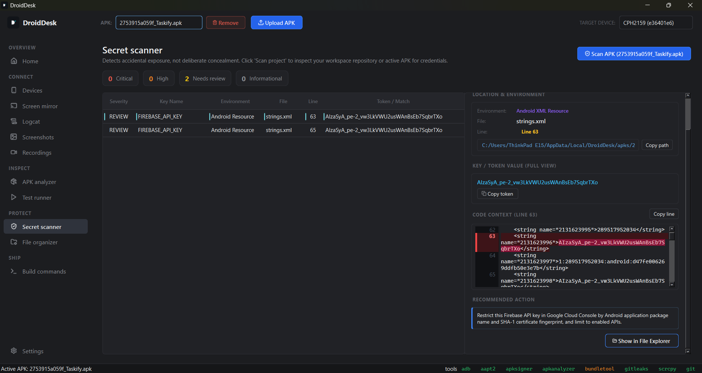

#### 🔍 What You See on Screen
- **Vulnerability Metric Badges:** Immediate severity summary: `0 Critical`, `0 High`, `2 Needs review`, `0 Informational`.
- **Detected Secrets Table:** Detailed findings showing Severity (`REVIEW`), Key Name (`FIREBASE_API_KEY`), Environment (`Android Resource`), File (`strings.xml`), Line number (`63`), and matched Token.
- **Deep Context & Remediation Inspector (Right Panel):**
  - **Location & Environment:** File path breadcrumb with `Copy path`.
  - **Full Token Value:** Complete exposed token string with `Copy token` button.
  - **Syntax-Highlighted Code Snippet:** Context viewer centering on Line 63 of `strings.xml`.
  - **Actionable Remediation Guidance:** Specific, practical security instructions: *"Restrict this Firebase API key in Google Cloud Console by Android application package name and SHA-1 certificate fingerprint, and limit to enabled APIs."*
  - `Show in File Explorer` button.

#### Demo User Instructions
1. Navigate to **Secret scanner** and click **Scan APK** (or select a local source folder).
2. Scan runs locally and 100% offline via the pre-bundled Gitleaks engine — zero cloud telemetry or data sharing.
3. Click any row in the findings table to inspect the exact line of code where the credential was found.
4. Follow the **Recommended Action** advice to lock down API keys before shipping to the Play Store.

---

### 10. 🗂️ Smart File Organizer & Batch Renamer
> **Sidebar Route:** `PROTECT > File organizer`

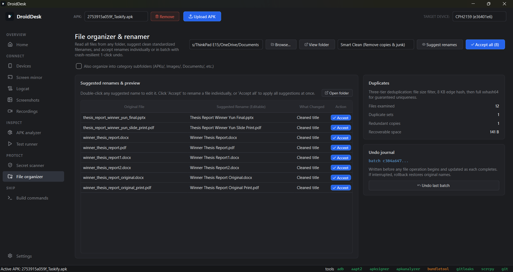

#### 🔍 What You See on Screen
- **Target Folder Selection:** Path selector with `Browse...`, `View folder`, `Smart Clean (Remove copies & junk)`, and `Suggest renames`.
- **Subfolder Categorization Toggle:** Option to auto-organize files into category folders (`APKs/`, `Images/`, `Documents/`, etc.).
- **Interactive Suggested Renames Table:** Side-by-side preview showing `Original File` alongside `Suggested Rename (Editable)` (transforms messy lowercase filenames with underscores into clean, professional title case), `What Changed` description, and individual `Accept` buttons or batch `Accept all (8)`.
- **Three-Tier Deduplication Engine:** Examines file size, 8 KB edge hash, and full xxhash64 to detect duplicate copies with zero false positives. Displays examined files count, duplicate sets, redundant copies, and recoverable disk space (`141 B`).
- **Crash-Resilient Undo Journal:** Logs each batch with unique transaction ID (`batch c384a647...`) and offers a 1-click **Undo last batch** button that restores original file names even if interrupted or closed.

#### Demo User Instructions
1. Click **Browse...** and select any messy folder with APK builds, test screenshots, or documents.
2. Click **Suggest renames** to see clean, standardized name suggestions.
3. Double-click any name in the table to make custom edits if desired.
4. Click **Accept all** to rename all files in one batch.
5. If you change your mind, click **Undo last batch** to instantly roll back every change!

---

### 11. 🚀 Commands Selection & Security Audit Hub
> **Sidebar Route:** `SHIP > Build commands`

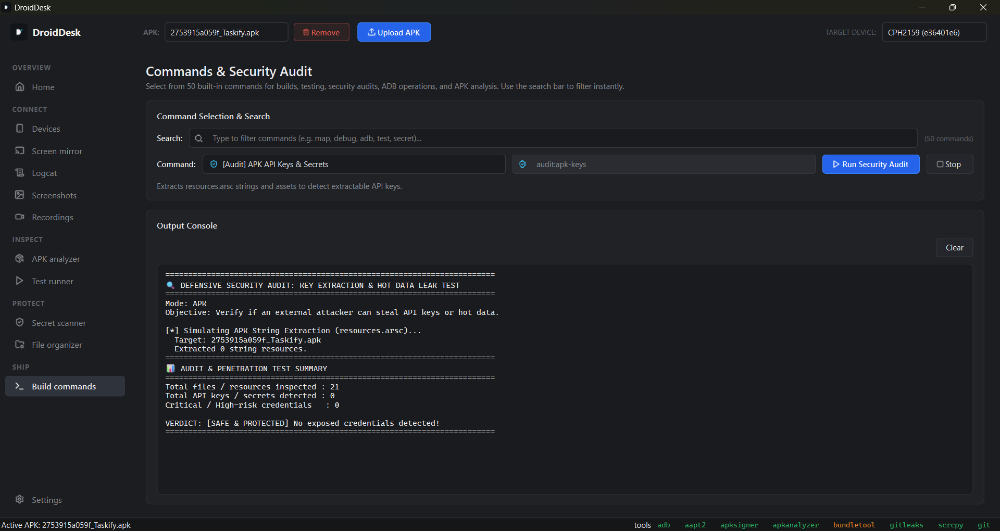

#### 🔍 What You See on Screen
- **Built-in Command Catalog:** Access to **50 built-in commands** covering builds, testing, security audits, ADB operations, and APK analysis.
- **Instant Search & Filter:** Filter bar with typeahead search (e.g., `audit`, `debug`, `adb`, `test`, `secret`).
- **Active Command Configuration:** Shows selected command `[Audit] APK API Keys & Secrets` (`audit:apk-keys`) with detailed description: *"Extracts resources.arsc strings and assets to detect extractable API keys."*
- **Execution Bar:** `Run Security Audit`, `Stop`, and `Clear` console.
- **Live Output Console:** Formatted security penetration test terminal output:
  - Simulating APK string extraction (`resources.arsc`).
  - Total files/resources inspected (`21`).
  - Exposed credentials detected (`0`).
  - Security verdict: `VERDICT: [SAFE & PROTECTED] No exposed credentials detected!`.

#### Demo User Instructions
1. Navigate to **Build commands** in the left sidebar.
2. In the Search box, type `audit` and select `[Audit] APK API Keys & Secrets`.
3. Click **Run Security Audit** to test whether third parties can reverse-engineer secrets out of your compiled binary.
4. Review the simulated extraction output directly inside the embedded console.

---

### 12. ⚙️ Settings, Inspection History & Credits
> **Sidebar Route:** `SETTINGS > Settings`

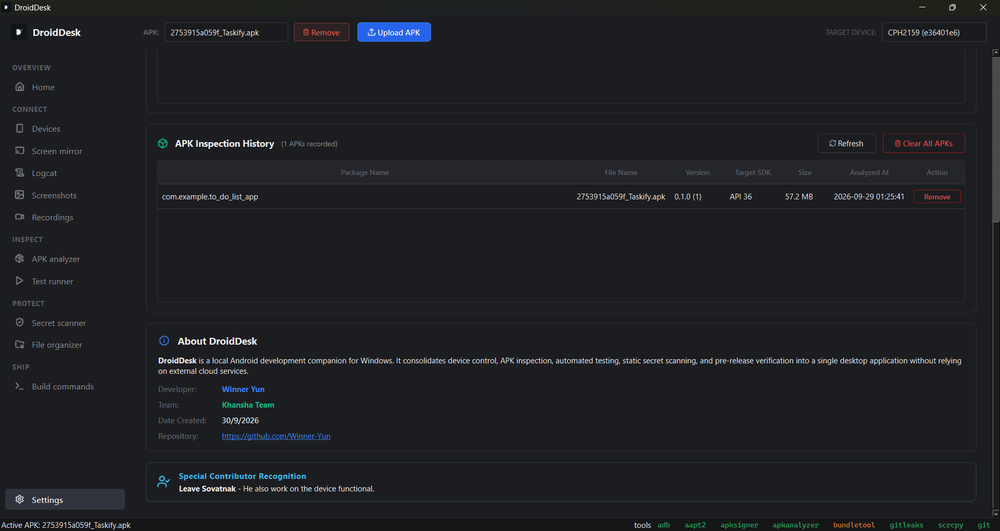

#### 🔍 What You See on Screen
- **APK Inspection History:** Persistent local log tracking all analyzed APK files (`com.example.to_do_list_app`, `2753915a059f_Taskify.apk`, `0.1.0 (1)`, `API 36`, `57.2 MB`, timestamp) with `Remove`, `Clear All APKs`, and `Refresh` buttons.
- **About DroidDesk Card:**
  - **Developer:** Winner Yun
  - **Team:** Khansha Team
  - **Date Created:** 30/9/2026
  - **Repository:** [https://github.com/Winner-Yun](https://github.com/Winner-Yun)
- **Special Contributor Recognition:** Highlights contributor **Leave Sovatnak** (*He also work on the device functional*).
- **Global Native Tool Indicators (Footer):** Persistent status strip verifying ADB, aapt2, apksigner, apkanalyzer, bundletool, gitleaks, scrcpy, and git.

#### Demo User Instructions
1. Click **Settings** in the lower-left corner of the sidebar.
2. Review your historical APK audit logs or click **Clear All APKs** to reset cache.
3. Access developer links and project repository details.

---

## ✨ Key Features

| Feature | Description |
| :--- | :--- |
| 🔍 **Deep APK Inspector** | Inspect manifest details, target/min SDKs, component counts (Activities, Services, Receivers), and dangerous permission alerts. |
| 🔏 **Certificate & Signature Audit** | Verify APK Signature Schemes (v1, v2, v3, v4) and display MD5, SHA-1, and SHA-256 signing fingerprints. |
| 📱 **Live Screen Mirroring** | Low-latency Android device screen mirroring powered by pre-bundled scrcpy. |
| 🎥 **Video Recording & Gallery** | Record device screen video clips during testing and browse recordings with generated thumbnails. |
| 🛡️ **Offline Secret Scanner** | Pre-bundled gitleaks engine to detect exposed API keys, private tokens, and credentials in APK files and source code. |
| ⚡ **Real-Time Logcat Viewer** | High-performance log streaming with quick filtering by level (Verbose, Debug, Info, Warn, Error, Assert) and regex search. |
| 🧪 **Automated Smoke Testing** | Automatic install, launch, screenshot capture, crash detection, and uninstall cycle. |
| 🔒 **100% Offline & Private** | Zero telemetry, zero tracking, no login required. Your code and APKs never leave your workstation. |

---

## 🛠️ System Requirements

- **Operating System:** Windows 10 or Windows 11 (64-bit / x64).
- **RAM:** Minimum 4 GB (8 GB recommended).
- **Disk Space:** ~500 MB free space.
- **Android SDK / ADB:** Auto-detected if Android Studio is installed. (You can also set custom paths in **Settings -> Tool Locator**).
- **Pre-bundled Tools:** Both scrcpy and gitleaks are already packaged with the installer — **no manual tool installation required!**

---

## ❓ Troubleshooting & FAQ

<b>1. Windows SmartScreen says Windows protected your PC</b>

Because this is a freshly published installer without an enterprise EV certificate, Windows may show a SmartScreen warning.  
Simply click <b>More info</b> and then click <b>Run anyway</b> to proceed with the setup.

<b>2. DroidDesk says No Device Connected or Device Unauthorized</b>

1. Unplug and replug your USB cable.  
2. Make sure USB Debugging is turned on in your phone's Developer Options.  
3. Unlock your phone and look for the popup prompt: <i>Allow USB debugging from this computer?</i>. Check <i>Always allow</i> and press <b>Allow</b>.  
4. In DroidDesk, click the <b>Reconnect / Refresh ADB</b> button in the top navigation bar.

<b>3. Tool Locator shows red status icons</b>

Go to <b>Settings</b> > <b>Tool Locator</b> inside DroidDesk:
- If ADB is not found automatically, enter your Android SDK path (typically C:\Users\<YourUsername>\AppData\Local\Android\Sdk).
- Scrcpy and Gitleaks are pre-bundled in the application folder and will display green indicators automatically.

---

## 📄 License & Documentation

- [Step-by-Step Setup Guide](SETUP_GUIDE.md)
- [Release Notes & Changelog](CHANGELOG.md)
- [License](LICENSE.txt)

---
*Created with ❤️ for Android Developers and Security Testers.*
